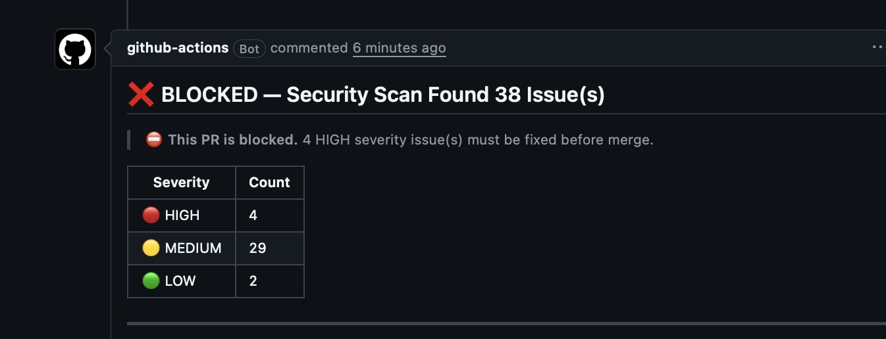
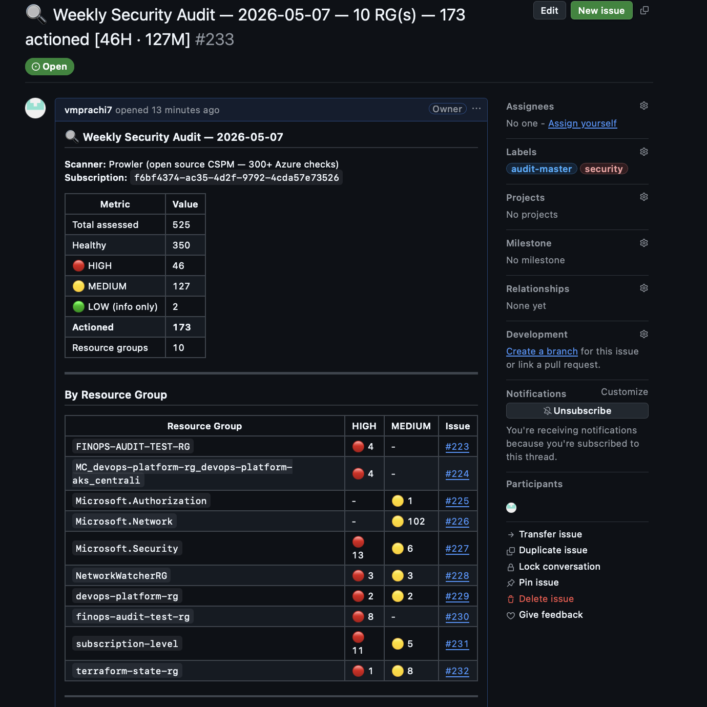
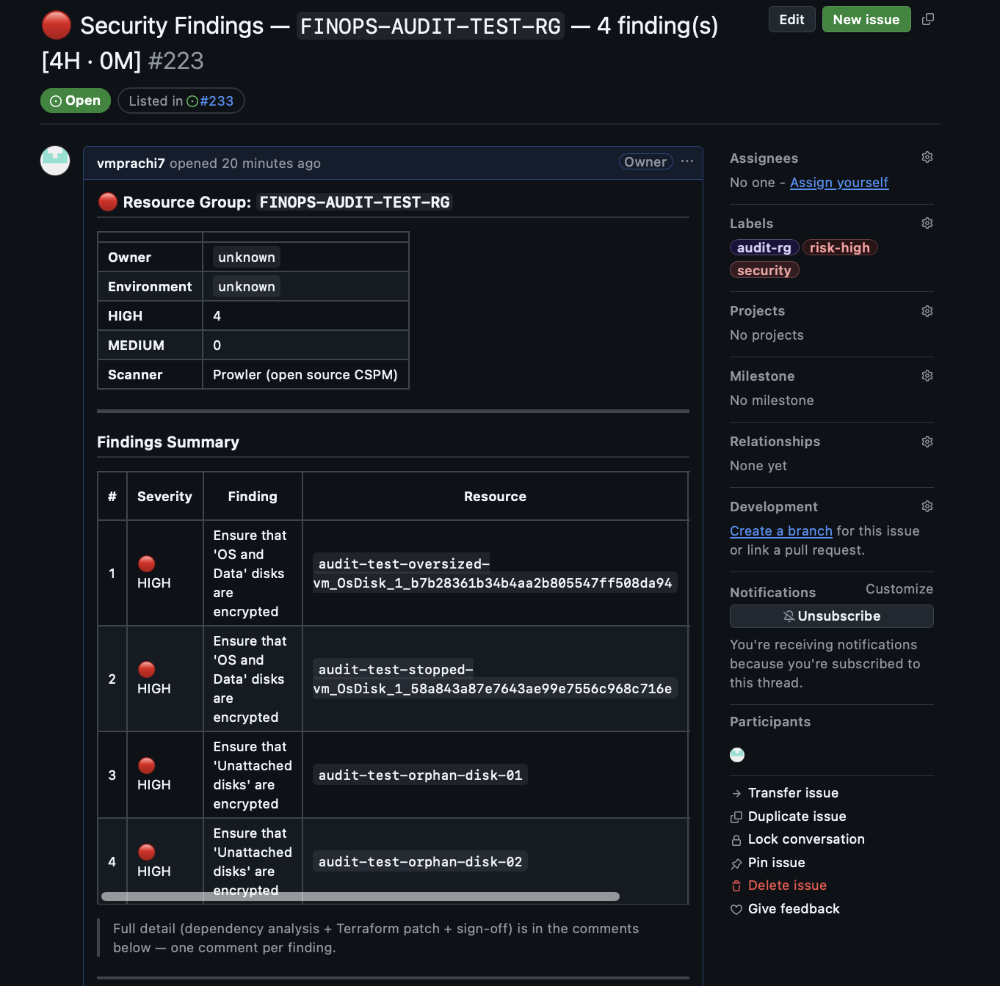
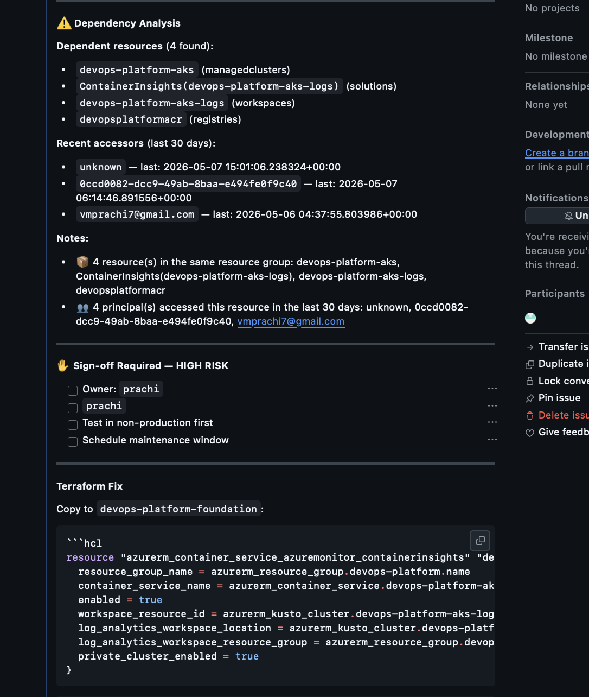
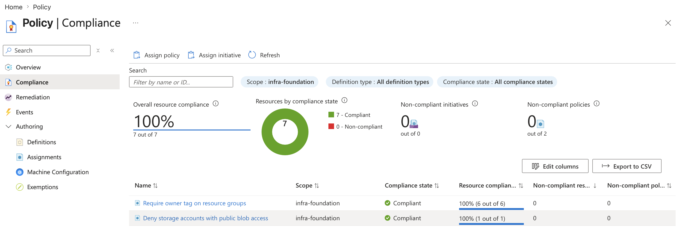

# Security Auditor

An automated security auditing system for Azure infrastructure that combines
open source scanning with AI-powered remediation guidance and blast radius analysis.

**The gap this fills:** Security scanners tell you *what* is misconfigured.
This tool adds *who will break if you fix it*, *what the Terraform change is*,
and *who needs to sign off* — organised per resource group as GitHub Issues.

---

## What it does

```
SHIFT LEFT — catch misconfigs before they reach Azure
────────────────────────────────────────────────────
Every Terraform PR in devops-platform-foundation:
  Checkov + tfsec scan only the changed .tf files
  Groq AI explains each finding in plain English
  PR blocked if HIGH severity found
  Plan job skipped until security passes


REMEDIATION — fix issues in existing live infra
────────────────────────────────────────────────
Weekly Prowler scan of live Azure resources:
  300+ security checks across Storage, AKS, Key Vault, NSGs
  Dependency analysis — ARM Resource Graph + Azure Monitor
    "3 teams use this storage account, last accessed 2h ago"
  Groq AI generates exact Terraform patch per finding
  GitHub Issues — one per resource group, all findings inside
    HIGH/MEDIUM actioned → collapsible detail + sign-off checklist
    LOW listed in master Issue for awareness only


AZURE POLICY — enforce security at creation time
────────────────────────────────────────────────
Custom policy definitions applied at subscription scope:
  Deny storage accounts with public blob access
  Require owner tag on all resource groups
```

---

## Architecture

```
security-auditor/  (this repo)
├── shift-left/
│   ├── scan.sh              Checkov + tfsec runner
│   └── ai_explainer.py      Explains findings, generates PR comment
│
├── remediation/
│   ├── scanner.py           Runs Prowler, parses JSON-OCSF output
│   ├── dependency.py        ARM Resource Graph + Azure Monitor
│   ├── patch_generator.py   Groq AI → Terraform HCL patch
│   ├── github_client.py     Creates Issue hierarchy
│   └── main.py              Orchestrator
│
├── policies/
│   ├── deny_storage_public_access.json
│   ├── require_resource_tags.json
│   └── apply_policies.sh
│
└── .github/workflows/
    ├── shift-left.yml        Reusable — called from infra repos
    └── remediation.yml       Weekly cron + manual trigger
```

---

## Screenshots

### Shift left — PR blocked on HIGH severity finding
to be done 


### Shift left — PR passes after fixing findings
to be done


### Weekly remediation — master summary Issue


### Weekly remediation — RG Issue with findings


### Weekly remediation — finding detail with Terraform patch


### Azure Policy compliance view



> 📸 Add screenshots to `.github/screenshots/` after your first scan run.

---

## GitHub Issue structure

Each weekly scan creates:

```
#N   🔍 Weekly Audit — 2026-05-07 — 3 RGs — 12 findings [8H·4M]
       └── #N+1  🔴 devops-platform-rg — [5H · 2M]
       └── #N+2  🟡 finops-rg — [0H · 2M]
       └── #N+3  🟡 audit-test-rg — [0H · 1M]
```

Each RG Issue contains:
- Summary table of all findings
- Fix checklist — check off as you fix each one
- Collapsible detail per finding: dependency analysis + Terraform patch + sign-off

When a finding is fixed — check the box. When all boxes are checked — close the RG Issue.
When all RG Issues are closed — close the master Issue.

---

## Quick start

### Prerequisites

- Python 3.11+
- Azure Service Principal with `Reader` + `Security Reader` roles
- GitHub PAT with `repo` scope
- Groq API key (free — [console.groq.com](https://console.groq.com))
- Prowler 4.x installed: `pip install prowler`

### ⚠️ Required: Tag your Azure resources

The dependency analysis and sign-off routing only work if your Azure resources
have the correct tags. Without tags, the tool cannot determine who owns a resource
or who needs to approve a patch.

**Minimum required tags on every resource group:**

```bash
# Tag a resource group
az group update   --name devops-platform-rg   --tags owner="platform-team"         environment="production"         stakeholders="platform,finops,aiops"

# Tag a storage account
az resource update   --ids /subscriptions/.../storageAccounts/devopsplatformacr   --set tags.owner="platform-team"        tags.environment="production"        tags.stakeholders="platform,finops"
```

**Tag reference:**

| Tag | Required | Example | Used for |
|---|---|---|---|
| `owner` | ✅ Yes | `platform-team` | Sign-off routing — who approves patches |
| `environment` | ✅ Yes | `production` / `dev` | Risk scoring — prod = higher blast radius |
| `stakeholders` | Recommended | `platform,finops` | Comma-separated teams who use this resource |

**Without `owner` tag:** the tool will still create Issues but cannot route
sign-off automatically. You will see `owner: unknown` in the dependency analysis.

**Tip — enforce tagging with Azure Policy:** The `require_resource_tags.json`
policy in this repo audits resource groups without an `owner` tag. Run
`bash policies/apply_policies.sh` to apply it at subscription scope.

### Local setup

```bash
git clone https://github.com/vmprachi7/security-auditor.git
cd security-auditor

python3 -m venv venv
source venv/bin/activate
pip install -r requirements.txt

cp .env.example .env
# Edit .env — fill in Azure credentials, Groq key, GitHub token
```

### Run with mock data (no Azure needed)

```bash
# USE_MOCK_DATA=true in .env
PYTHONPATH=. python remediation/main.py
```

Creates 4 GitHub Issues (1 master + 3 RG Issues) using simulated findings.

### Run against live Azure

```bash
# USE_MOCK_DATA=false in .env
# Authenticate with Azure CLI first
az login

PYTHONPATH=. python remediation/main.py
```

Prowler uses your `az login` session locally via `--az-cli-auth`.

---

## Shift left — add to your Terraform repo

Copy this file to your Terraform repo:

```bash
# In devops-platform-foundation
mkdir -p .github/workflows
cp ../security-auditor/examples/devops-platform-foundation-workflow.yml \
   .github/workflows/terraform-ci.yml
```

The workflow adds a `security-scan` job before `terraform plan`:

```
PR opened → security-scan → plan (blocked if HIGH found) → apply (on merge)
```

The security job:
- Scans only `.tf` files changed in the PR (not the entire repo)
- Posts findings as a PR comment with AI explanation
- Blocks the plan if any HIGH severity finding is found
- Deletes old scan comments on re-push — PR stays clean

---

## GitHub Secrets required

### In `security-auditor` repo

| Secret | Description |
|---|---|
| `ARM_CLIENT_ID` | Service Principal app ID |
| `ARM_CLIENT_SECRET` | Service Principal password |
| `ARM_TENANT_ID` | Azure tenant ID |
| `ARM_SUBSCRIPTION_ID` | Azure subscription ID |
| `GROQ_API_KEY` | From console.groq.com |
| `SECURITY_GITHUB_TOKEN` | GitHub PAT with `repo` scope |

### In `devops-platform-foundation` repo (shift left)

| Secret | Description |
|---|---|
| `GROQ_API_KEY` | From console.groq.com |

All Azure secrets already exist from the platform foundation setup.

---

## Azure Policy

Apply the custom policies to your subscription (one-time):

```bash
az login
bash policies/apply_policies.sh
```

**Policy 1 — Deny storage with public blob access**
Effect: `Deny` — blocks creation/update at deployment time.
Any `terraform apply` that sets `allow_blob_public_access = true` will be rejected by Azure.

**Policy 2 — Require owner tag on resource groups**
Effect: `Audit` — logs non-compliant resource groups without blocking.
Change to `Deny` once all resource groups are tagged.

---

## Why Prowler instead of Microsoft Defender for Cloud

### What we evaluated first

Microsoft Defender for Cloud was the obvious first choice — it's native to Azure,
has 200+ security assessments, and integrates deeply with the portal.

### Why it wasn't used

Defender's assessments API (`security_client.assessments.list()`) requires the
**Defender CSPM paid tier** to return findings. The free tier authenticates
successfully but returns zero assessments via API.

```
Tested with: azure-mgmt-security==7.0.0
Result: total_assessed=0, total_healthy=0, non_compliant=0
Defender portal shows findings — API returns nothing on free tier.
```

Paid Defender CSPM costs approximately $0.007 per resource per hour
($5/resource/month). For a learning/portfolio subscription this isn't justified.

### Why Prowler

Prowler is the industry-standard open source CSPM tool:

- Used in production at Netflix, Twilio, and other large organisations
- 300+ Azure checks covering the same surface as Defender
- Completely free — Apache 2.0 licence
- Outputs structured JSON-OCSF format
- Actively maintained — new checks added regularly
- Cloud-agnostic — same tool works for AWS, GCP, Azure, Kubernetes

For organisations that already have Defender CSPM enabled,
swapping back to Defender is a two-line change in `scanner.py`.

### How to switch to Defender (if you have paid tier)

If your organisation has Defender CSPM enabled, replace `scanner.py`
with the Defender-based version:

**Step 1 — Verify Defender is returning assessments:**
```bash
az security assessment list \
  --query "[?status.code=='Unhealthy'].{name:name,resource:resourceDetails.id}" \
  --output table
```

If this returns findings — Defender API will work.

**Step 2 — Add Security Reader role to your SP:**
```bash
az role assignment create \
  --assignee "$ARM_CLIENT_ID" \
  --role "Security Reader" \
  --scope "/subscriptions/$ARM_SUBSCRIPTION_ID"
```

**Step 3 — Update `scanner.py`** to use the Defender client:
```python
from azure.mgmt.security import SecurityCenter

client = SecurityCenter(credential, subscription_id)
scope  = f"/subscriptions/{subscription_id}"

for assessment in client.assessments.list(scope):
    if assessment.status.code == "Unhealthy":
        # process finding — same structure as Prowler output
```

The rest of the stack (dependency analysis, patch generator, GitHub client)
works identically regardless of whether findings come from Prowler or Defender.

---

## Environment variables

```bash
# Azure credentials
AZURE_SUBSCRIPTION_ID=your-subscription-id
AZURE_TENANT_ID=your-tenant-id
AZURE_CLIENT_ID=your-sp-appId
AZURE_CLIENT_SECRET=your-sp-password

# AI (Groq free tier — console.groq.com)
GROQ_API_KEY=gsk_your-key

# GitHub PAT with repo scope
GITHUB_TOKEN=ghp_your-token
GITHUB_REPO=vmprachi7/security-auditor

# Scanner settings
DEPENDENCY_LOOKBACK_DAYS=30   # days of Azure Monitor history to check
USE_MOCK_DATA=false            # true = use mock findings (no Azure needed)
```

---

## ⚠️ Security notice — Groq AI in production

This tool uses [Groq's free tier](https://console.groq.com) to generate
Terraform patch explanations and finding summaries.

**What is sent to Groq:**
- Security finding title and description (from Prowler)
- Resource name, resource group, resource type
- Prowler check ID and remediation guidance

**What is NOT sent to Groq:**
- Subscription ID or tenant ID
- Actual resource configurations or secrets
- Network topology or IP addresses

**For most teams this is acceptable** — finding titles like
*"Storage account allows public blob access"* and resource names
are not sensitive data.

**For compliance-sensitive environments** (SOC 2, ISO 27001, HIPAA,
financial services, government) review whether sending resource names
and finding descriptions to a third-party API is acceptable under
your data classification policy.

### Production alternatives

| Option | How | Trade-off |
|---|---|---|
| **Azure OpenAI Service** | Deploy GPT-4o inside your Azure tenant | Costs money, data never leaves your subscription |
| **Ollama (self-hosted)** | Run Llama 3.1 on a VM inside your VNet | Free, fully private, needs compute |
| **Disable AI layer** | Set `GROQ_API_KEY=` to empty | Falls back to rule-based patches — still works |

### Swapping to Azure OpenAI — one file change

In `remediation/patch_generator.py` and `shift-left/ai_explainer.py`,
replace the Groq client with:

```python
# Azure OpenAI — data stays in your tenant
client = OpenAI(
    api_key=os.getenv("AZURE_OPENAI_KEY"),
    base_url=f"{os.getenv('AZURE_OPENAI_ENDPOINT')}/openai/deployments/gpt-4o",
    default_headers={"api-key": os.getenv("AZURE_OPENAI_KEY")},
)
```

The AI layer is intentionally provider-agnostic — swapping providers
requires changing two lines, not a refactor.

---

## Risk levels and sign-off requirements

| Risk | Approval required | Apply how |
|---|---|---|
| 🔴 HIGH | Owner + all stakeholders + maintenance window | Manual only |
| 🟡 MEDIUM | Team lead + verify no dependents break | Manual, low-traffic window |
| 🟢 LOW | Listed in master Issue for awareness | No action required |

**Nothing is ever applied automatically.**
The tool generates the Terraform patch and routes it to the right people.
A human reviews, approves, and applies it.

---

## Technology stack

| Layer | Component | Version | Why chosen |
|---|---|---|---|
| **Security scanning** | [Prowler](https://github.com/prowler-cloud/prowler) | 4.x | Open source CSPM, 300+ Azure checks, used at Netflix/Twilio, free |
| **Shift left — IaC** | [Checkov](https://github.com/bridgecrewio/checkov) | 3.x | Industry standard, 1000+ Terraform rules, integrates with GitHub Actions |
| **Shift left — Azure** | [tfsec](https://github.com/aquasecurity/tfsec) | latest | Azure-specific rules, faster than Checkov for targeted scans |
| **AI layer** | [Groq](https://console.groq.com) + Llama 3.1 | llama-3.1-8b-instant | Free tier, <2s response, provider-agnostic (swap to Azure OpenAI for prod) |
| **Dependency analysis** | ARM Resource Graph | Azure SDK | Query all Azure resources + relationships in one API call |
| **Access history** | Azure Monitor Activity Logs | azure-mgmt-monitor 6.x | Who accessed a resource in the last 30 days |
| **Issue management** | [PyGithub](https://github.com/PyGithub/PyGithub) | 2.1.1 | GitHub Issues as structured audit trail with checklists |
| **Authentication** | Azure SP + OIDC (Workload Identity) | — | Passwordless CI/CD — no stored credentials, short-lived tokens |
| **Policy enforcement** | Azure Policy | — | Deny non-compliant resources at deployment time, not after |
| **Language** | Python | 3.11 | Matches rest of portfolio, rich Azure SDK ecosystem |

---

## Related projects

This is part of a 4-project DevOps portfolio:

- [devops-platform-foundation](https://github.com/vmprachi7/devops-platform-foundation) — AKS + ArgoCD + Observability
- [finops-intelligence-engine](https://github.com/vmprachi7/finops-intelligence-engine) — AI-powered cost anomaly dashboard
- [agentic-aiops](https://github.com/vmprachi7/agentic-aiops) — Prometheus alert → AI runbook agent
- **security-auditor** (this repo) — Shift left + remediation + policy enforcement

---

*Prachi · Senior DevOps & Platform Engineer · Gurugram, India*
*[LinkedIn](https://www.linkedin.com/in/prachi-v/) · [GitHub](https://github.com/vmprachi7)*